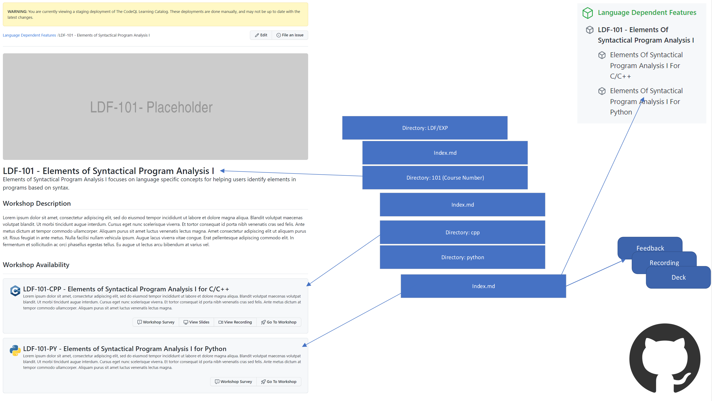

# <br>CodeQL Learning Catalog

[Browse The Catalog](https://codeql-learning-catalog.github.com)
&nbsp;•&nbsp;
[Open an issue](../../issues)

<br>

The CodeQL Learning Catalog is a resource dedicated providing detailed CodeQL
learning resources. The Catalog contains workshops, recordings, and learning
paths for improving your knowledge and skill in using CodeQL.

# How to Use The Catalog

The CodeQL Learning Catalog can be used in two different ways: as a workshop
author and as a workshop participant. In either use case, you may launch a
codespace from this repository with the following configurations:

- `.devcontainer/authors/devcontainer.json` - The container targeted for
  authors. This contains additional tools for creating workshops.
- `.devcontainer/devcontainer.json` - The container for workshop participants.
  This contains the components needed to execute the workshop examples.

The finished workshops may be found on the web at:
https://codeql-learning-catalog.github.com

# Authoring Guide

For authors, there are 5 main steps that you must perform to author a workshop.
If you are authoring a tailored workshop you must perform an additional step,
which is forking this repository within the customer organization.

1. [ ] Create / Pickup Tracking Issue
2. [ ] Identify an Editor
3. [ ] Identify Workshop Prefix
4. [ ] Identify Workshop Code
5. [ ] Fork Repository **(Tailored Workshops Only)**
6. [ ] Open and Merge your PR :tada:

## Step 1: Create / Pickup Tracking Issue

- All workshop development is accompanied with a tracking issue, which can be
  found in the issues tab of this repository.

- You will use the tracking issue for the development of your workshop. It might
  already exist! In that case you will pick up the existing issue. Otherwise,
  feel free to create it using our issue templates.


## Step 2: Identify an Editor

An editor is like a code reviewer in that they are responsible for approving the
PR containing your workshop. However, an editor has additional
responsibilities, which we outline, below:

Editors look for:

- **Style** -- "Typically we have an introduction before a section..."
- **Consistency** -- "Perhaps we should use the same example throughout..."
- **Clarity** -- "I think it would be easier to understand if..."
- **Comprehensiveness** -- "What are we leaving out?"
- **Coherency** -- "Is this supposed to be here?"
- **Grammar** -- "Eats shoots and leaves vs Eats, shoots, and leaves"

## Step 3: Identify Workshop Prefix

All workshops are prefixed with a three letter code. The table, below, explains
the codes used to categorize workshops.


## Step 4: Identify Workshop Code

All workshops also have a workshop code which helps categorize workshops in
terms of difficulty. The following diagram details our workshop code system.


## Step 5: Forking This Repository (Tailored Workshops Only)

Not all workshops may be written for a general audience and must be specialized.
To support this, in the `codeql-workshops` org you will fork the
`codeql-learning-catalog` repo and create a custom private repository where you
will author your private workshop. You will be responsible for ensuring the
proper access rights are granted to workshop participants.

## Step 6: Open and Merge your PR

Lastly, you must open your PR and merge it. You should ensure that you and your editor have
previewed the finished site prior to merging.

# Authoring Features

This section covers some of the technical features that will be useful to
workshop authors.

## Starting an Editing Environment

The workshop system has been designed to be easy to use for both authors and
workshop participants. For authors, you have been provided with a specialized
image that contains not only the CodeQL binaries but additional binaries and
scripts for authoring.

The easiest way to get started is with codespaces. For authoring you will select
the `.devcontainer/authors/devcontainer.json` image, which is shown pictured,
below. At least 8 cores is recommended for a smooth authoring experience.


## Directory Structure

An important aspect of your workshop is its placement in the directory
structure. In general, all workshops will live below the `docs` directory. From
there, there are two types of structures: language independent workshops and
language dependent workshops.

### Language Independent Workshops

Language _independent_ workshops exist as a single variation of a workshop,
unlike language _dependent_ workshops, which require a dedicated workshop for a
course. Language independent workshops follow the structure pictured, below:


### Language Dependent Workshops

Language _dependent_ workshops are workshops that are variations done on a _per
language_ basis. For example, in the diagram below, we show two copies of a
workshop: one for `cpp` and one for `python`.


### Metadata and Generated Elements

Within the `index.md` files of your workshop you will notice a metadata section.
It is critical to fill this part of your workshop out so that it renders
properly in the workshop system. The following diagram shows how various
`index.md` files are rendered within the workshop system.

As a workshop author you are generally only responsible for the `index.md` file
within your workshop's top level directory. However, if you are creating a new
workshop for which the parent paths do not exist, you are also responsible for
those markdown files as well.

**For Workshop Index Files**
The fields in your workshop's `index.md` are as follows:

- `layout` - Should always be `workshop-index` **required**
- `title` - The title of your workshop. **required**
- `course_number` - The course catalog course number. **required**
- `abstract` - A short description **required**
- `language` - the language this workshop is for. **required**
- `feedback` - A link to a survey for this workshop. _optional_
- `banner` - A graphical banner to display at the top of this workshop page. _optional, but strongly encouraged_
- `video` - A video recording of this workshop _optional_.
- `deck` - The slides for this workshop _optional_.
- `octicon` - The icon to use. Should almost always be `package` -- if you want to use another icon for your page, https://github.com/primer/octicons
- `toc` - controls if a TOC is displayed on your page.
- `topics` - A comma separated list of topics, e.g.: dataflow, taint

The following code example shows you the fields that are available within your
workshop for metadata tagging purposes.

```
---
layout: workshop-index
title: Elements of Syntactical Program Analysis I for Python
course_number: LDF-101-PY
abstract: Lorem ipsum dolor sit amet, consectetur adipiscing elit, sed do eiusmod tempor incididunt ut labore et dolore magna aliqua. Blandit volutpat maecenas volutpat blandit. Ut morbi tincidunt augue interdum. Cursus eget nunc scelerisque viverra. Et tortor consequat id porta nibh venenatis cras sed felis. Ante metus dictum at tempor commodo ullamcorper. Aliquam purus sit amet luctus venenatis lectus magna.
language: python
feedback: https://www.feedback.com
banner: banner-code-graph-shield.png
video: url-to-your-video
deck: url-to-your-deck
octicon: package
toc: false
---
```



**For Workshop Pages**
The fields in an individual workshop page are:

- `layout` - Should always be `page` **required**
- `title` - The title of your workshop. **required**
- `banner` - A graphical banner to display at the top of this workshop page. _optional, but strongly encouraged_
- `octicon` - The icon to use. Should almost always be `package` -- if you want to use another icon for your page, https://github.com/primer/octicons
- `toc` - controls if a TOC is displayed on your page.
- `topics` - A comma separated list of topics, e.g.: dataflow, taint

The following code example shows you the fields that are available within your
workshop for metadata tagging purposes.

```
---
layout: page
title: Setting up your development environment
octicon: package
toc: false
---
```

## Switching Java versions easily with Jenv

Authors need to provide a precompiled database for the readers, and if you are working on a Java/Kotlin workshop, you would probably run into some Java version mismatches when invoking the build system for extraction. For easily switching between different Java versions, we have [Jenv](https://www.jenv.be/) as well as three different versions of OpenJDK (8, 11, and 17) preinstalled.

OpenJDK 8 is set as default. To see the current version:

```shell
$ jenv version
1.8 (set by /root/.jenv/version)
```

To list all installed versions:

```shell
$ jenv versions
  system
* 1.8 (set by /root/.jenv/version)
  1.8.0.372
  11
  11.0
  11.0.18
  17
  17.0
  17.0.6
  openjdk64-11.0.18
  openjdk64-17.0.6
  temurin64-1.8.0.372
```

To set a global Java version, say to 11:

```shell
jenv global 11
```

To set a Java version for the current working directory, recursively down to its subdirectories:

```shell
jenv local 11
```

Note that it creates a `.java-version` file at the cwd to remember its per-directory version settings.

## Previewing Your Work

To preview your work, at a command prompt type:

```
script/server
```

From the root of this repository.

## Formatting Markdown Documents

Markdown lint will fail if you don't format your markdown. We use Prettier to
help with all things formatting. When you save your document it will
automatically reformat.

If you want to manually reformat, you can use: `CMD/CTRL + Shift + P -> Format Document`

You are also **highly** encouraged to use `rewrap` to make sure your markdown
documents don't have lines that are too long / normalized. To do that, select
your text and execute `CMD/CTRL + Shift + P -> Rewrap Comment / Text`.

## Inserting Code Blocks

To prevent examples that do not run from being used in workshops, this system
provides a way to ensure your examples are runnable.

Any time you have a `ql` example, you must provide a unit test and a source file
for the `ql`. To insert that code into your workshop you may use custom
directives.

**To insert an entire file**

<pre>
```ql file=./src/myfile.ql
```
</pre>

**To insert a portion of a file**

<pre>
```ql file=./src/solutions/PuzzleOneAttemptTwoB.ql#L1-L17
```
</pre>

## Making Your Content Findable

To increase relevancy of results, the workshop catalog does not perform full
text indexing. Search results are based on two factors: 1) title and 2) topics.
You may influence the search relevancy by either altering your title or adding a
`topics` metadata tag to the frontmatter of any page. For example:

```
---
layout: workshop-index
title: Elements of Syntactical Program Analysis I for C/C++
topics: dataflow, taint
toc: false
---
```
